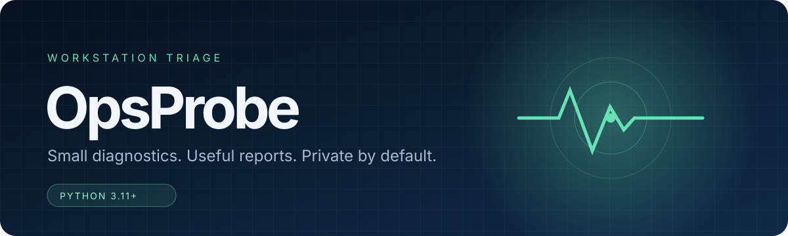

<p align="center">
  
</p>

<p align="center">
  <a href="https://github.com/ReedStel/opsprobe/actions/workflows/ci.yml"></a>
  
  <a href="LICENSE"></a>
</p>

OpsProbe is a privacy-first command-line tool for the first few minutes of workstation triage. It checks local system health, DNS, TCP and verified HTTPS connectivity, then creates a report that can be reviewed before it is attached to a support ticket.

It has no runtime dependencies, works across Windows, macOS and Linux, and does not run as an agent or send telemetry.

## Why I built it

Early support calls often start with the same small set of questions: Is the disk nearly full? Does the local TCP/IP stack work? Can the machine resolve a known host? Can it establish a connection and complete TLS verification?

OpsProbe makes that first pass consistent without collecting a full device inventory. It is deliberately narrow: one chosen target, one TCP port and reports that omit machine identifiers by default.

```text
$ opsprobe doctor --offline

OpsProbe 0.1.0  ·  2026-08-17T00:00:00+00:00
────────────────────────────────────────────────────────────────────
PASS  Disk headroom          Disk space has a healthy buffer. (0.3 ms)
PASS  Local TCP/IP stack     The local hostname resolves correctly. (1.2 ms)
PASS  Runtime                Python runtime is supported. (0.0 ms)
────────────────────────────────────────────────────────────────────
Overall: PASS
```

## What it checks

| Check | Purpose | Data retained |
| --- | --- | --- |
| Disk headroom | Flags volumes below 15% and 5% free | Capacity and free-space percentage |
| Local TCP/IP | Confirms `localhost` resolution | Address-family names only |
| DNS | Resolves one chosen target | Record count and address families, not IPs |
| TCP 443 | Tests a bounded outbound connection | Port, timeout and outcome |
| HTTPS | Performs a certificate-verified request | HTTP status and outcome |
| Runtime | Confirms the supported Python version | Python version |

The online checks run concurrently, but results are returned in a stable order so reports are easy to compare.

## Install

Clone the repository and install it into a virtual environment:

```bash
git clone https://github.com/ReedStel/opsprobe.git
cd opsprobe
python -m venv .venv
```

On Windows PowerShell:

```powershell
.venv\Scripts\Activate.ps1
python -m pip install -e .
```

On macOS or Linux:

```bash
source .venv/bin/activate
python -m pip install -e .
```

Python 3.11 or newer is required.

## Use

Run the default profile against `example.com`:

```bash
opsprobe doctor
```

Choose a different known host and a shorter timeout:

```bash
opsprobe doctor --target github.com --timeout 2
```

Run local checks only:

```bash
opsprobe doctor --offline
```

Create reports for a ticket or handover:

```bash
opsprobe doctor \
  --json reports/diagnostic.json \
  --markdown reports/ticket.md \
  --html reports/diagnostic.html
```

The HTML report is self-contained and uses no JavaScript or remote assets. A shortened JSON example is available in [`examples/sample-report.json`](examples/sample-report.json).

To see the collection boundary from the command line:

```bash
opsprobe explain-data
```

## Privacy by default

Default reports do not include the hostname, username, home-directory path or resolved IP addresses. Exporters also perform a best-effort recursive redaction of:

- home paths, usernames and hostnames
- email addresses
- IPv4 and IPv6 addresses
- MAC addresses
- credentials embedded in URLs

Identifiers can be included with `--include-identifiers` when a technician has a clear reason to do so. Redaction is not a guarantee, so OpsProbe always tells the operator to review an export before sharing it.

## How it fits together


The code stays split along those boundaries:

```text
src/opsprobe/
├── checks.py        # Local, DNS, TCP and HTTPS checks
├── cli.py           # Arguments, terminal output and exit codes
├── models.py        # Typed check and report structures
├── privacy.py       # Recursive best-effort redaction
├── reporting.py     # JSON, Markdown and HTML renderers
├── runner.py        # Validation, concurrency and profile assembly
└── system_info.py   # Minimal cross-platform context collection
```

The reasoning behind the main boundaries is recorded in [`docs/design-notes.md`](docs/design-notes.md).

## Development

Install the optional development tools and run the same checks used in CI:

```bash
python -m pip install -e ".[dev]"
python -m ruff check src tests
python -m unittest discover -s tests -v
opsprobe doctor --offline --no-colour
```

GitHub Actions runs linting, unit tests and an offline smoke test across Windows, macOS and Linux on Python 3.11 and 3.12.

## Current limits

- Memory collection is best-effort and may return `null` on an unfamiliar platform.
- The default profile tests outbound HTTPS only; it is not a general network scanner.
- There is no background service, remote control or central report store.
- Redaction reduces accidental disclosure but cannot replace a human review.

Those limits are intentional for the first release. The next useful additions are a pluggable check interface, signed report metadata and clearer proxy diagnostics.

## Licence

OpsProbe is available under the [MIT Licence](LICENSE).
